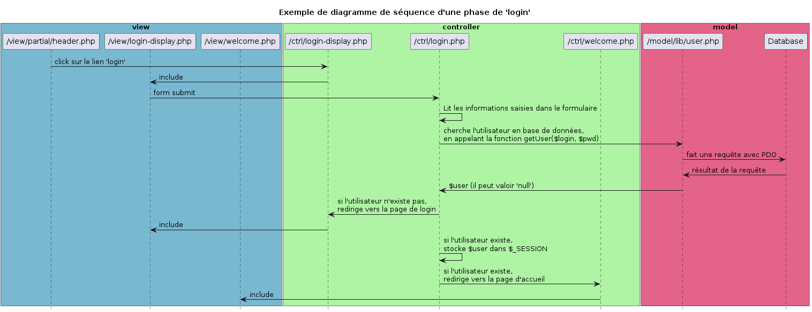

# Atelier 430-php-login-YAO

## Objectifs

A partir des consignes et des ressources fournies,

réaliser un mini site web qui présente les fonctionnalités très utiles d'inscription et d'authentification pour accéder à du contenu restreint.

## Consignes / contraintes

La réalisation utilise une base de données.

Les Entités à utiliser sont :
- User(email*, password)
- Role(code*, label)

Les Relations sont :
- Un Utilisateur possède exactement un Rôle
- Un Rôle peut être utilisé par plusieurs Utilisateurs

Les pages à fournir sont :

- page publique, libre d'accès

- page restreinte d'accès, il faut posséder un certain Rôle pour lire son contenu

- page de login, qui redirige par la page publique

- page d'inscription

Le site web permet de naviguer entre les différentes pages.

Le site web permet de se déconnecter.

### aspects techniques

- ré-utiliser au maximum la structure de code standard MVC fournie dans les ateliers précédents

- dans un premier temps, le mot de passe est stocké en clair en base de données

- dans un second temps, le mot de passe est hashé lors de l'inscription, puis vérifié lors de l'authentification

- :bulb: pour commencer, créer 'en dur' l'Utilisateur de voter choix en base de données à la main, pour se concentrer sur la phase d'authentification; la phase d'inscription est secondaire.

## Ressources

- tout ce qui a déjà été fait dans les précédents ateliers, front & back !

- diagramme de séquence d'une phase d'authentification (login)

## Mots-clé

- #login / #register
- #_SESSION
- #password_hash()
- #password_verify()

## Modalités pédagogiques

Travail en groupe possible, restitution individuelle.

## Checklist du livrable

- [ ] le livrable est une archive zip nommée avec la technique du 'quoi-qui-quand'
- [ ] le livrable permet au Client de tester  les fonctionnalités livrées...
- [ ] le code est versionné sous 'git'
- [ ] chaque page du site contient une balise 'title' unique
- [ ] chaque page du site contient une balise 'meta description' unique
- [ ] chaque page du site est conforme au validator W3C

